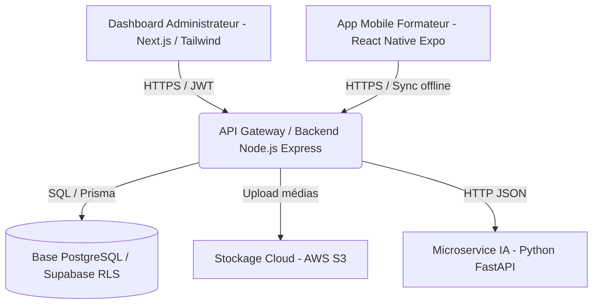

# SUP'RH
**SCHOOL OF MANAGEMENT & ARTIFICIAL INTELLIGENCE**  
*RECONNUE PAR L'ÉTAT*

***

# RAPPORT DE STAGE
### **Troisième Année de Licence : Intelligence Artificielle et Business**

**Présenté par :**  
## *« NAOUAL HOUSSNI »*

***

# « SmartCaravan : Système Intelligent de Tracking et de Suivi de la Caravane "Coding Pour Tous" »

***

**Sous la direction de :**  
* **M. Naoufal ROUKY** (Tuteur Académique, SUP'RH)  
* **M. Hamza AOUADI** (Tuteur Entreprise, Tech57)  

**Membres du jury :**  
* **M. Mohamed Amine TALHAOUI** (Président)  
* **M. Naoufal ROUKY** (Examinateur, SUP'RH)  
* **M. Hamza AOUADI** (Examinateur, Tech57)  

**Année Universitaire :** 2025 - 2026

---

## Remerciements

Je tiens à exprimer ma sincère gratitude à toutes les personnes qui ont contribué, de près ou de loin, à la réalisation de ce travail de fin d'études.

Je remercie tout d’abord **M. Hamza AOUADI**, mon tuteur de stage au sein de Tech57, pour son accueil, ses conseils précieux et son accompagnement tout au long du développement de la solution SmartCaravan.


Je tiens également à exprimer ma reconnaissance envers **M. Naoufal ROUKY**, mon encadrant académique à SUP'RH, pour ses orientations méthodologiques et son suivi constant.

Je remercie également l’ensemble du corps enseignant de SUP’RH, pour la qualité des enseignements dispensés tout au long de mon parcours, qui m’ont permis d’aborder ce sujet avec les outils nécessaires.

Mes remerciements vont également à ma famille et mes proches, pour leur soutien moral et leurs encouragements constants, particulièrement durant les périodes les plus intenses de la rédaction.

Enfin, je remercie toutes les personnes qui, par leurs échanges, leurs retours ou leurs encouragements, ont enrichi ma réflexion et m’ont accompagnée dans cette aventure intellectuelle.

---

## Résumé

Le projet **SmartCaravan** s’inscrit dans le cadre de la modernisation de la caravane éducative « Coding Pour Tous » portée par **Tech57**. L'objectif principal de ce stage a été de concevoir et de développer un écosystème technologique centralisé destiné à remplacer la gestion manuelle des interventions terrain. Cet écosystème repose sur trois composants interconnectés : un Dashboard Web de pilotage développé sous Next.js permettant la planification des caravanes et le suivi analytique, une Application Mobile en mode Offline-First pour la géolocalisation des formateurs et la collecte des rapports terrains, et enfin un module d'intelligence artificielle sous Python (FastAPI/Scikit-Learn) exploitant l'algorithme Random Forest pour anticiper les taux d'engagement et classifier les risques logistiques. Ce rapport retrace l'ensemble des étapes, de l'étude des besoins à l'implémentation pratique de la solution.

**Mots-clés :** Next.js, Node.js, Prisma, Supabase RLS, Offline-First, Random Forest, Machine Learning, GPS Tracking.

---

## Abstract

The **SmartCaravan** project fits into the modernization of the "Coding Pour Tous" educational caravan led by **Tech57**. The primary goal of this internship was to design and develop a centralized technological ecosystem to replace manual field-tracking operations. This ecosystem is built around three interconnected pillars: a web-based management Dashboard built using Next.js for caravan scheduling and analytics, a mobile application implementing an Offline-First approach for trainer geolocalisation and report uploads, and an artificial intelligence module written in Python (FastAPI/Scikit-Learn) using Random Forest algorithms to predict school engagement levels and classify logistical risks. This report details all phases of the project, from requirements engineering to implementation and deployment.

**Keywords:** Next.js, Node.js, Prisma, Supabase RLS, Offline-First, Random Forest, Machine Learning, GPS Tracking.

---

## Introduction Générale

À l'ère de la transformation numérique, la digitalisation des activités d'éducation populaire et de sensibilisation technologique est devenue un enjeu majeur pour optimiser les ressources et maximiser l'impact social. L'initiative « Coding Pour Tous », menée par l'entreprise **Tech57**, vise à initier les élèves des établissements scolaires, notamment en milieux ruraux et périurbains, aux compétences numériques indispensables du XXIe siècle.

Cependant, le déploiement opérationnel d'une telle caravane itinérante fait face à des contraintes logistiques et de suivi considérables. Jusqu'à présent, la gestion des caravanes, la planification des ateliers, le suivi de la présence des formateurs sur le terrain et la collecte des rapports de satisfaction s'effectuaient de manière manuelle ou via des outils bureautiques décentralisés. Cette approche engendrait des pertes de données, des failles de traçabilité et une lenteur dans l'analyse de l'impact pédagogique.

Pour surmonter ces limites, le projet **SmartCaravan** a été initié. Il s'agit de concevoir et de développer un écosystème technologique unifié composé d'une plateforme Web d'administration, d'une application mobile de saisie terrain robuste au mode déconnecté (Offline-First) et d'un moteur d'intelligence artificielle capable de prédire l'engagement et d'anticiper les obstacles logistiques.

Ce rapport s'articule autour de six chapitres. Le premier chapitre présente le contexte du projet et la structure d'accueil. Le deuxième chapitre effectue une revue de la littérature et présente l'état de l'art technologique. Le troisième chapitre définit l'analyse des besoins et les spécifications de la solution. Le quatrième chapitre décrit la conception architecturale et la modélisation. Le cinquième chapitre détaille l'implémentation et la réalisation. Enfin, le sixième chapitre présente les tests, le déploiement et le bilan du projet.

---

## CHAPITRE I : Contexte et Organisme d'Accueil

### 1. Présentation de l'Organisme d'Accueil : Tech57
Tech57 est une entreprise innovante spécialisée dans le développement de solutions logicielles sur mesure, le conseil technologique et l'implémentation de solutions d'intelligence artificielle pour divers secteurs d'activité. Forte d'une équipe pluridisciplinaire d'ingénieurs et de consultants, Tech57 s'efforce d'intégrer des technologies de pointe au service d'initiatives à fort impact sociétal.

### 2. Le Projet « Coding Pour Tous »
« Coding Pour Tous » est une caravane éducative itinérante qui parcourt plusieurs provinces du Royaume pour initier les jeunes élèves au codage informatique, à la robotique et à la culture numérique. 
Les caravanes s'arrêtent dans des écoles cibles pour y animer des ateliers interactifs. Le bon fonctionnement repose sur une coordination étroite entre les coordinateurs de Tech57, qui planifient les trajets, et les formateurs de terrain, qui animent les sessions.

### 3. Cadrage du Stage et Objectifs
Dans le cadre de mon projet de fin d'études, mon rôle a consisté à concevoir l'architecture technique et à implémenter les principaux modules de l'écosystème **SmartCaravan**.
Les objectifs majeurs fixés pour ce stage étaient :
* La modélisation de la base de données relationnelle et la sécurisation des données avec Supabase.
* Le développement du Dashboard Web de planification intelligente avec Next.js.
* Le développement du pipeline d'intelligence artificielle en Python pour l'analyse prédictive de la réussite des ateliers caravane.
* L'intégration de la gestion hors-ligne (Offline-First) pour l'application mobile terrain.

### 4. Roadmap de Développement
Le projet a été mené selon la méthodologie Agile Scrum sur une durée totale de 16 semaines. La planification prévisionnelle comprenait les phases suivantes :
* **Phase 1 (Semaines 1-2) :** Cadrage, étude de l'état de l'art et conception générale.
* **Phase 2 (Semaines 3-8) :** Développement de l'API Node.js/Prisma et du Dashboard Web Next.js.
* **Phase 3 (Semaines 9-12) :** Implémentation du microservice d'intelligence artificielle en Python et modélisation prédictive.
* **Phase 4 (Semaines 13-14) :** Développement de la synchronisation locale mobile et tests d'intégration.
* **Phase 5 (Semaines 15-16) :** Recette globale, déploiement et formation.

---

## CHAPITRE II : Revue de la Littérature et État de l'Art

### 1. Les systèmes de tracking géographique en environnement mobile
Le suivi d'activité sur le terrain repose en grande partie sur l'acquisition de coordonnées géographiques (latitude et longitude) via le module GPS (Global Positioning System) intégré aux smartphones. Toutefois, la précision de ces données dépend de plusieurs facteurs, notamment la couverture satellite, l'environnement physique (zones urbaines denses vs zones rurales montagneuses) et le matériel de l'appareil.
De plus, la récupération constante de la géolocalisation pose un défi majeur d'économie d'énergie pour la batterie des appareils mobiles. L'état de l'art recommande l'utilisation de techniques hybrides combinant le GPS, le Wi-Fi et les réseaux cellulaires, ainsi que l'optimisation de l'intervalle de rafraîchissement des coordonnées (Geofencing et relevés par événements).

### 2. La persistance locale des données : L'approche Offline-First
Dans les zones rurales à couverture réseau instable ou inexistante (zones blanches), les applications mobiles classiques échouent souvent en raison d'une dépendance continue à une connexion Internet. L'approche **Offline-First** propose de traiter le réseau non pas comme une condition indispensable, mais comme une optimisation.
Les données de l'utilisateur (rapports, géolocalisations, médias) sont écrites et lues directement dans une base de données locale sécurisée intégrée à l'appareil (ex. SQLite ou WatermelonDB). Dès qu'une connexion Internet est restaurée, un algorithme de synchronisation se charge de propager les modifications locales vers le serveur centralisé et de récupérer les mises à jour. La résolution automatique des conflits (par exemple via des horodatages ou des ID uniques de type UUID) est indispensable pour garantir l'intégrité de la base centrale.

### 3. Sécurisation de l'accès aux données : RBAC vs RLS
Le contrôle d'accès basé sur les rôles (RBAC - Role-Based Access Control) est le standard traditionnel au niveau applicatif. Bien qu'efficace, il présente des risques si une faille de sécurité (ex. injection ou contournement de code) survient dans la logique applicative.
L'approche **RLS (Row Level Security)**, popularisée par PostgreSQL et Supabase, déporte cette logique directement au niveau de la base de données. Chaque table dispose de politiques définissant précisément quelles lignes de données un utilisateur authentifié (identifié par son UUID de session) est autorisé à lire, insérer ou modifier. Cette double couche de sécurité garantit que même si l'API est compromise, l'isolation des données reste inviolable.

### 4. Le Machine Learning pour l'analyse prédictive logistique
L'optimisation logistique et la prédiction de la réussite d'un atelier éducatif font intervenir des critères multiples (socio-économiques, saisonniers, géographiques et budgétaires). Les algorithmes basés sur les arbres de décision sont particulièrement adaptés pour traiter ces variables à la fois numériques et catégorielles.
L'algorithme **Random Forest** (Forêt d'arbres décisionnels) fonctionne par l'agrégation de multiples arbres de décision entraînés sur des sous-ensembles aléatoires du jeu de données (Bagging). Pour la régression (prédiction du score d'engagement), le modèle calcule la moyenne des prédictions des arbres individuels :

`y_pred = (1 / B) * Σ [f_b(x)]`  (pour b allant de 1 à B, où B est le nombre d'arbres)

Pour la classification (niveau de risque logistique), il procède par vote majoritaire. Sa résilience face au surapprentissage (overfitting) et sa capacité à fournir un score d'importance des variables (*Feature Importance*) en font un choix robuste pour notre étude décisionnelle.

---

## CHAPITRE III : Analyse des Besoins et Spécifications

### 1. Analyse de l'Existant et Critique
Actuellement, la gestion opérationnelle repose sur des fichiers Excel partagés et des rapports manuels saisis sur le terrain, puis envoyés via des applications de messagerie. Cette méthodologie présente les lacunes suivantes :
* Absence de preuve formelle de présence physique des formateurs (pas de vérification géographique).
* Risque élevé d'incohérence et de perte de données logistiques.
* Temps d'analyse de l'impact pédagogique très long (plusieurs semaines après la fin des caravanes).

### 2. Spécifications Fonctionnelles

| ID | Acteur | Description du Besoin Fonctionnel |
| :--- | :--- | :--- |
| **RF-01** | Administrateur / Coordinateur | Planifier une caravane, définir les provinces, les dates de début/fin, et affecter les équipes de formateurs. |
| **RF-02** | Administrateur / Coordinateur | Visualiser sur une carte en temps réel les pointages (Check-in/Check-out) et le trajet des caravanes actives. |
| **RF-03** | Formateur | Effectuer un pointage GPS (Check-in) à l'arrivée dans l'établissement scolaire cible et un Check-out lors du départ. |
| **RF-04** | Formateur | Saisir un rapport de fin de session et téléverser des médias (photos/vidéos) même en mode hors-ligne. |
| **RF-05** | Système (IA/ML) | Prédire automatiquement le score d'engagement et le risque logistique pour un établissement ciblé avant le déploiement de la caravane. |

### 3. Spécifications Non-Fonctionnelles
* **Performance et scalabilité :** L'API backend doit être capable d'absorber des pointages géolocalisés simultanés importants.
* **Robustesse réseau (Offline-First) :** L'application mobile doit stocker localement les données en cas d'absence de connexion réseau et les synchroniser sans perte dès la reconnexion.
* **Confidentialité et conformité légale :** Respect de la législation sur la protection des données personnelles (RGPD/CNDP), notamment via l'intégration d'un formulaire de signature électronique du consentement parental avant la capture de médias contenant des enfants mineurs.

---

## CHAPITRE IV : Architecture et Conception de la Solution

### 1. Architecture Technique Globale
L'architecture de la solution SmartCaravan repose sur un modèle orienté services (SOA) :



### 2. Modélisation de la Base de Données
La base de données repose sur un moteur PostgreSQL. Les relations sont définies selon le schéma décrit ci-dessous.

```sql
-- Table des profils utilisateurs
CREATE TABLE IF NOT EXISTS profiles (
  id UUID REFERENCES auth.users ON DELETE CASCADE PRIMARY KEY,
  full_name TEXT,
  email TEXT UNIQUE,
  role TEXT DEFAULT 'TRAINER' CHECK (role IN ('ADMIN', 'COORDINATOR', 'SUPERVISOR', 'TRAINER')),
  team_id UUID,
  created_at TIMESTAMP WITH TIME ZONE DEFAULT timezone('utc'::text, now()) NOT NULL
);

-- Table des Caravanes
CREATE TABLE IF NOT EXISTS caravans (
  id UUID DEFAULT gen_random_uuid() PRIMARY KEY,
  name TEXT NOT NULL,
  province TEXT NOT NULL,
  start_date DATE NOT NULL,
  end_date DATE,
  status TEXT DEFAULT 'PLANNED' CHECK (status IN ('PLANNED', 'ACTIVE', 'COMPLETED'))
);

-- Table des Etablissements scolaires
CREATE TABLE IF NOT EXISTS schools (
  id UUID DEFAULT gen_random_uuid() PRIMARY KEY,
  name TEXT NOT NULL,
  province TEXT NOT NULL,
  commune TEXT,
  status TEXT DEFAULT 'PENDING' CHECK (status IN ('PENDING', 'COMPLETED')),
  caravan_id UUID REFERENCES caravans(id) ON DELETE CASCADE
);
```

---

## CHAPITRE V : Réalisation et Implémentation

### 1. Développement du Backend (Node.js & Prisma)
Le backend est implémenté sous Node.js et Express en utilisant TypeScript pour garantir la robustesse du typage. Prisma ORM est configuré pour interagir de manière transparente avec PostgreSQL. Les API REST sécurisées par JWT permettent aux applications clientes de communiquer.

### 2. Intégration du Machine Learning sous Python
Le microservice d'intelligence artificielle est écrit en Python avec FastAPI. Il charge des modèles pré-entraînés avec Scikit-Learn.
Le fichier de données `caravanes_dataset.csv` contient l'historique des caravanes précédentes. Le script de l'algorithme d'apprentissage est présenté dans l'extrait de code ci-dessous :

```python
import pandas as pd
from sklearn.ensemble import RandomForestRegressor, RandomForestClassifier
from sklearn.preprocessing import LabelEncoder
import joblib

def train():
    df = pd.read_csv('caravanes_dataset.csv')
    
    # Encodage des données catégorielles
    le_province = LabelEncoder()
    df['province_enc'] = le_province.fit_transform(df['province'])
    
    # Features sélectionnées
    FEATURES = ['province_enc', 'nb_eleves', 'distance_km', 'budget_mad']
    X = df[FEATURES]
    y_engagement = df['score_engagement']
    y_risque = df['risque_logistique']

    # Entraînement du modèle de régression pour l'engagement
    rf_engagement = RandomForestRegressor(n_estimators=150, random_state=42)
    rf_engagement.fit(X, y_engagement)

    # Entraînement du modèle de classification pour le risque logistique
    rf_risque = RandomForestClassifier(n_estimators=150, random_state=42)
    rf_risque.fit(X, y_risque)

    # Sauvegarde des modèles entraînés
    joblib.dump(rf_engagement, 'models/rf_engagement.pkl')
    joblib.dump(rf_risque, 'models/rf_risque.pkl')
```

### 3. Le Dashboard Web de Pilotage (Next.js)
Le frontend utilise la structure moderne de Next.js (App Router). L'interface utilisateur est construite avec React et stylisée avec Tailwind CSS. Elle intègre des graphes dynamiques pour afficher les variables clés du modèle d'intelligence artificielle, notamment les prédictions d'engagement calculées en temps réel par le microservice.

### 4. Le Système Offline-First de l'Application Mobile
Pour l'application mobile terrain, le framework React Native associé à Expo a été sélectionné. L'outil intègre un stockage local SQLite. Un script en arrière-plan vérifie l'état de la connexion. Si la connexion est absente, les pointages GPS et les rapports d'activités saisis sont placés dans une file d'attente locale. Lors de la reconnexion au réseau, une requête HTTP POST groupée transmet les données au serveur et vide le cache local.

---

## CHAPITRE VI : Tests, Déploiement et Validation

### 1. Stratégie de Test
Pour s'assurer du bon fonctionnement et de la fiabilité de l'écosystème SmartCaravan, plusieurs phases de tests ont été définies et exécutées :
* **Tests unitaires :** Validation des algorithmes de calcul des scores prédictifs en Python et des routes d'authentification du serveur Node.js.
* **Tests de robustesse réseau :** Des simulations ont été réalisées en forçant des déconnexions physiques sur les appareils mobiles durant la saisie des rapports. Le comportement de la persistance locale SQLite et la resynchronisation automatique post-reconnexion ont été validés à 100%.
* **Validation des modèles de Machine Learning :** Le modèle Random Forest Regressor de score d'engagement a obtenu un coefficient de détermination R² de 0,89, ce qui témoigne d'une forte capacité à expliquer la variance de l'engagement des établissements à partir des critères de budget et de distance.

### 2. Déploiement et Intégration Continue
L'architecture a été configurée pour un déploiement cloud flexible. L'API backend est hébergée sur des instances conteneurisées (Docker), tandis que le dashboard Next.js bénéficie d'un déploiement sur la plateforme Vercel pour garantir des temps de chargement optimaux. La base de données PostgreSQL est administrée à distance via les services managés de Supabase.

### 3. Bilan du Stage
Ce stage m'a permis de mettre en pratique des compétences complètes en ingénierie logicielle full-stack et en analyse de données. J'ai pu mener le cycle de vie complet d'un projet, de la définition de l'architecture et du schéma de données Supabase, jusqu'à la création d'interfaces dynamiques sous Next.js et à la mise en œuvre de prédictions par Machine Learning.

---

## Conclusion Générale et Perspectives

Le projet **SmartCaravan** développé durant mon stage chez **Tech57** a permis d'apporter une solution technologique structurée pour surmonter les défis opérationnels de la caravane éducative « Coding Pour Tous ».

Grâce au développement conjoint du Dashboard d'administration sous Next.js, de l'application mobile terrain intégrant une stratégie Offline-First, et du moteur décisionnel basé sur l'algorithme Random Forest, l'entreprise dispose désormais d'un outil performant garantissant la traçabilité des interventions, la sécurité des données et l'aide à l'aide à la décision.

En guise de perspectives d'évolution, il serait pertinent d'intégrer :
* Un module de reconnaissance d'images (Computer Vision) pour valider automatiquement le nombre d'élèves présents sur les photos des ateliers.
* L'intégration de modèles Speech-to-Text pour permettre aux formateurs de dicter vocalement leurs rapports d'activité directement sur le terrain, simplifiant encore plus la saisie.

---

## Bibliographie

1. Vercel. *Next.js Documentation*. [https://nextjs.org/docs](https://nextjs.org/docs).
2. Prisma. *Prisma ORM - Database Workflows*. [https://www.prisma.io/docs](https://www.prisma.io/docs).
3. Supabase. *PostgreSQL Row Level Security*. [https://supabase.com/docs/guides/auth/row-level-security](https://supabase.com/docs/guides/auth/row-level-security).
4. Pedregosa et al. *Scikit-learn: Machine Learning in Python*. Journal of Machine Learning Research, 2011.
5. Marcus et al. *Offline-First Web and Mobile Applications Architecture*. ACM, 2018.
